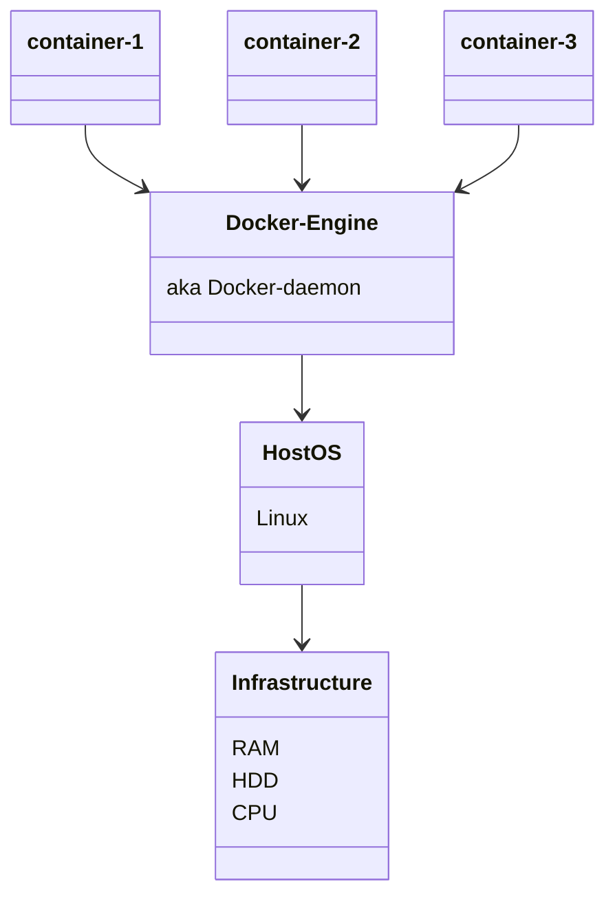

# What is docker
Docker is a set of platform as service products that use OS-level virtualization. 

The Three Innovations:
1. Docker Image 
2. Docker Register
3. Docker Container

These three innovations go together. 

The aforementioned three innovations serve the following purposes in sequence: : Build -> Ship -> Run

## The Docker image
Docker images act as the starting point when using Docker to start container.

## The Docker regsitry 
Universal app distribution 

- docker push : to push the docker image to a image registry
- docker pull : to download the docker image from a registry

## The Docker Container
Identical runtime environment

<mark>!Note :</mark> 
- Docker does not use traditional virtualization to run containers on macOS. On macOS, Docker uses a component called Docker Desktop to enable containerization. 

- Docker Desktop for macOS uses a translation layer called "xhyve" (a lightweight virtualization solution) to enable Linux containers to run on macOS. 

- This allows containers to interact with macOS file systems, networking, and other resources seamlessly