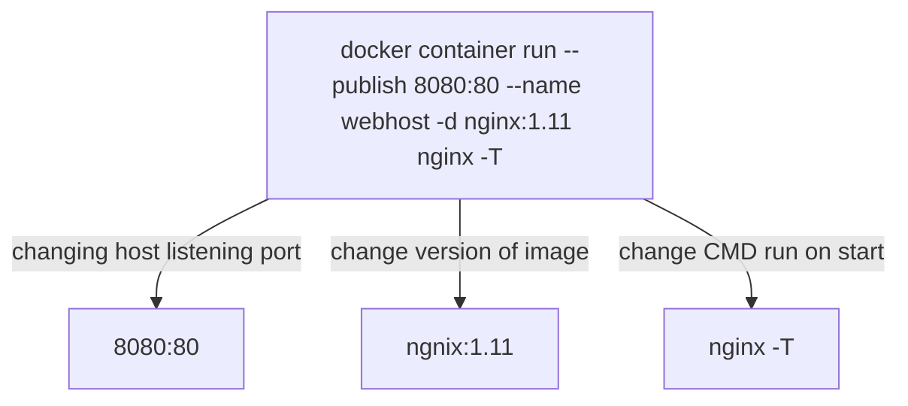

# Image vs Container
- An image is the application we want to run
- A Container is an instance of that image running as a process
- You can have many containers running off the same image
- Docker's default image "registry" is Docker Hub

```
docker container run --publish 80:80 nginx
```
    1. Downloaded image 'nginx' from Docker Hub
    2. Started a new container from that image
    3. Opened port 80 on the host IP
    4. Routes that traffic to the container IP, port 80

```
docker container run --publish 80:80 --detach nginx
```
    1. detach makes the container run in background

## Commands
- List running container using ```docker ps```
- Stop container using ```docker stop <container-id> ```
- List all containers including those not running ```dockker ps -a```
- Remove container using ```docker container rm <container-id1> <container-id2>```, Only first few letters are necessary to name the container id rest docker does the autofill behind the scenes
- Remove container by force using ```docker container rm -f <container-id>```


## What happends in 'docker container run' ?

1. Looks for that image locally in image cache, doesn't find anything
2. Then looks in remote image repository (defaults to Docker Hub)
3. Downloads the latest version (ngnix:latest by default)
4. Creates new container based on that image and prepares to start
5. Gives it a virtual IP on a private network inside docker engine
6. Opens up port 80 on host and forwards to port 80 in container
7. Starts container by using the CMD in the image Dockerfile


## Example of changing the defaults 

```docker container run --publish 8080:80 --name webhost -d nginx:1.11 nginx -T```

