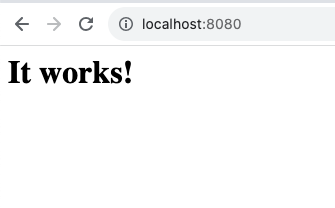

# Assignment : Manage Multiple Containers

- Run a nginx, a mysql and httpd (apache) sever
- Run all of them --detach (or -d), name them with --name
- nginx should listen on 80:80 , httpd on 1234:1234 , mysql on 3306:3306

# Solution 

1. Nginx
```
docker container run --publish 80:80 --name MyNgnix -detach nginx
```
](images/02_05-Assignment3.png)

2. Mysql
```
docker container run --publish 3306:3306 --name DemoMysql -detach mysql
```
3. httpd (apache) server
```
docker container run --publish 1234:1234 --name myhttpd -detach httpd
```
](images/02_05-Assignment2.png)

## Docker ps -a
](images/02_05-Assignment1.png)