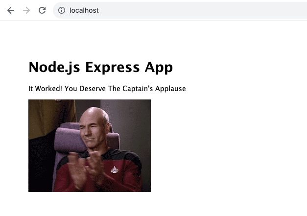

# Build your own image

- Take existing Node.js app and Dockerize it
- Make ```Dockerfile```. Build it. Test it. Push it . Run it. 
- Expect this to be iterative. not always easy to get it right first time. 
- file in 03_exercises/dockerfile-assignment-1
- Use alpine version of the official 'node' 6.x image
- Expected result is web site at http://localhost
- Tag and push to your Docker Hub account


## Steps
- Setup dockerfile
- RUN ```docker build -t testnode .```
- RUN ```docker container run --rm -p 80:3000 testnode```



- Tag image
```docker tag testnodeapp account-name/testnode```

- Push to docker hub
```docker push --help```
```docker push accountname/testnode```

- Remove from local machine
```docker image rm <image-name>```

- Check if image is removed 
```docker image ls```

- Pull and run again
```docker run -it --rm -p 80:3000 account-name/testnode```


- Check space usage of all images 
```docker system df```

- Basic clean commands
```docker container prune```
```docker image prune```
```docker volume prune```
```docker system prune```
