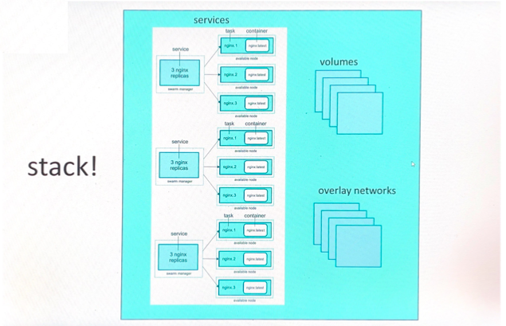

# Docker Stack


- In 1.13 Docker adds a new layer of abstraction to Swarm called Stacks

- When running Docker Engine in swarm mode, you can use docker stack deploy to deploy a complete application stack to the swarm

- Stacks accept Compose files as their declarative definition for services, networks, and volumes

- We use ```docker stack deploy``` rather than docker service create

- Stacks manages all those objects for us, including overlay network per stack. Adds  stack name to start of their name

- New ```deploy:``` key in Compose file. Can't do ```build:```

### SWARM


### STACK



Example of docker stack : https://docs.docker.com/engine/swarm/stack-deploy/


Assignment from 06_assignment for docker swarm i.e the voting app can also be deployed using docker stack
- example : 06_Assignment/example-voting-app-stack.yml

### Steps to deploy:

1. First deploy the stack
```
docker stack deploy -c example-voting-app-stack.yml voteapp
```
2. check deployed service 
```
docker stack ps
```
3. check running services in detail
```
docker stack ps voteapp
```
4. check running replicas of each service
```
docker stack services voteapp
```
5. check more in detail
```
docker stack services voteapp
```
6. check overlay networks created
```
docker network ls
```